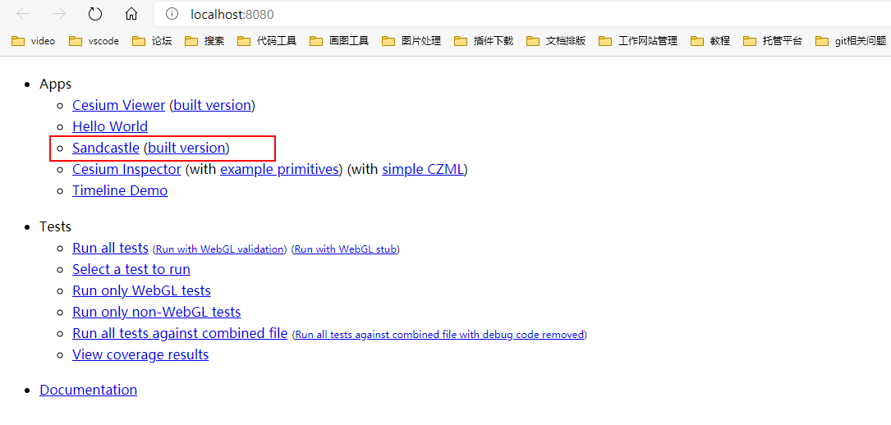
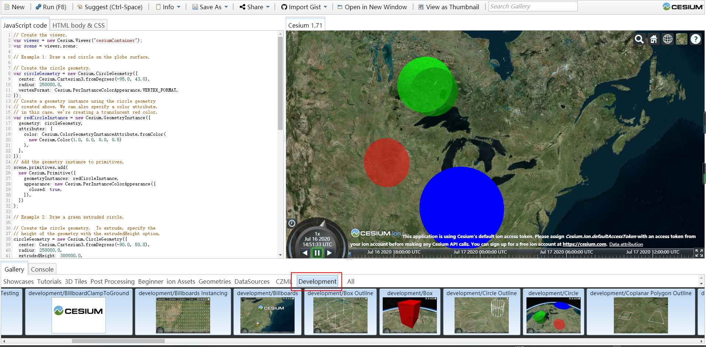

# Cesium本地运行

[github 地址](https://github.com/CesiumGS/cesium)
[Cesium 官网](https://cesium.com/cesiumjs/)

## 本地运行

- 将 github 项目 clone 到本地
- 安装所需依赖以及 build 打包

````shell
  npm install # cnpm install
  npm run build # 将代码打包
``
- 本地启动
```shell
  npm run start # 本地启动
````

> 默认地址 http://localhost:8080/ > 
> Sandcastle 中为 cesium 所有的示例

> Sandcastle 中的 development 只有经过代码打包以后再进行服务启动才会出现
> 
