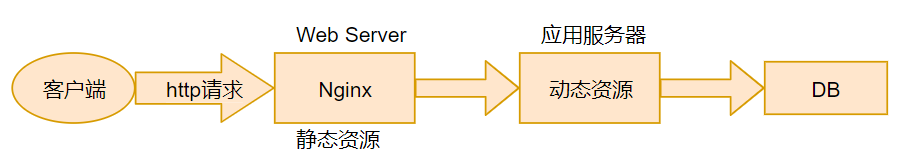

# Nginx 概述

> [nginx中文文档](https://www.nginx.cn/doc/)

## 概念

> 百度百科 Nginx (engine x) 是一个高性能的 HTTP 和反向代理 web 服务器，同时也提供了 IMAP/POP3/SMTP(电子邮件) 服务。其特点是占有内存少，并发能力强。

## 应用场合

- 高性能的静态 WEB 服务器--------通过本地文件系统提供服务
- 反向代理-------缓存加速 负载均衡
- API 服务--------OpenResty

> 百度百科 反向代理服务器位于用户与目标服务器之间，但是对于用户而言，反向代理服务器就相当于目标服务器，即用户直接访问反向代理服务器就可以获得目标服务器的资源。同时，用户不需要知道目标服务器的地址，也无须在用户端作任何设定。反向代理服务器通常可用来作为 Web 加速，即使用反向代理作为 Web 服务器的前置机来降低网络和服务器的负载，提高访问效率。

## 诞生的历史背景

- 互联网数据的快速增长
- Apache 处理请求的低效性

|        Apache        |        Nginx         |
| :------------------: | :------------------: |
| 一个进程处理一个请求 | 一个进程处理多个请求 |
|       阻塞式的       |      非阻塞式的      |

> 一个 http 请求的全流程剖析
> 

## 核心优势

- 高并发 高性能
- 扩展性好
- 异步非阻塞的事件驱动模型
- 高可靠性
- 热部署 平滑升级
- BSD许可(开源)
