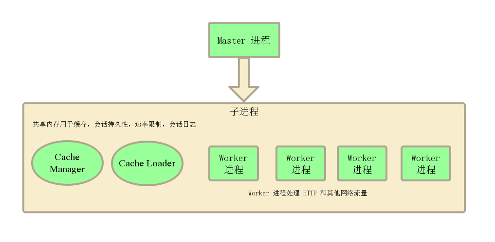

# Nginx 进程结构

> [nginx 中文文档](https://www.nginx.cn/doc/)

## nginx 进程结构图

> nginx 进程结构图
> 

### nginx 进程结构每部分的作用

- Master Process: 并不处理请求 管理其他模块和子进程
  > 子进程挂掉会重启新的子进程
  > 配置文件修改 主进程通知子进程按配置文件修改(热部署)
- Work Process: 处理请求
- Cache Manager: 管理缓存
- Cache Loader: 加载缓存
  > 子进程之间通过共享内存进行通信
