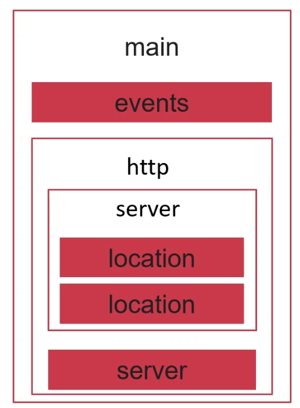

# Nginx 配置文件结构

- [nginx官方网站](http://nginx.org/)
- [nginx官方帮助文档](http://nginx.org/en/docs/)
- [nginx中文文档](https://www.nginx.cn/doc/)

## 配置文件结构图



- main 全局设置

- events 事件模块设置

- http 核心模块设置

## 实战修改配置文件

### 备份配置文件

```shell
cp nginx.conf nginx.conf.bak # 将nginx.conf备份到 nginx.conf.bak
```

### 查看/修改配置文件

```shell
vim nginx.conf
```

````shell
```shell
user  nginx; # 进程用户
worker_processes  1; # 定义启动进程数量 auto 与服务器核心数相同 或者直接指定cpu

#error_log  logs/error.log;
#error_log  logs/error.log  notice;
#error_log  logs/error.log  info;

#pid        logs/nginx.pid;


events {
    worker_connections  1024; # 处理连接数
}


http {
    include       mime.types;
    default_type  application/octet-stream;

    #log_format  main  '$remote_addr - $remote_user [$time_local] "$request" '
    #                  '$status $body_bytes_sent "$http_referer" '
    #                  '"$http_user_agent" "$http_x_forwarded_for"';

    #access_log  logs/access.log  main;

    sendfile        on;
    #tcp_nopush     on;

    #keepalive_timeout  0;
    keepalive_timeout  65;

    #gzip  on;

    server {
        listen       80;
        server_name  localhost;

        #charset koi8-r;

        #access_log  logs/host.access.log  main;

        location / {
            root   html;
            index  index.html index.htm;
            }

        #error_page  404              /404.html;

        # redirect server error pages to the static page /50x.html
        #
        error_page   500 502 503 504  /50x.html;
        location = /50x.html {
            root   html;
        }

        # proxy the PHP scripts to Apache listening on 127.0.0.1:80
        #
        #location ~ \.php$ {
        #    proxy_pass   http://127.0.0.1;
        #}

        # pass the PHP scripts to FastCGI server listening on 127.0.0.1:9000
        #
        #location ~ \.php$ {
        #    root           html;
        #    fastcgi_pass   127.0.0.1:9000;
        #    fastcgi_index  index.php;
        #    fastcgi_param  SCRIPT_FILENAME  /scripts$fastcgi_script_name;
        #    include        fastcgi_params;
        #}

        # deny access to .htaccess files, if Apache's document root
        # concurs with nginx's one
        #
        #location ~ /\.ht {
        #    deny  all;
        #}
    }


    # another virtual host using mix of IP-, name-, and port-based configuration
    #
    #server {
    #    listen       8000;
    #    listen       somename:8080;
#    server_name  somename  alias  another.alias;

    #    location / {
    #        root   html;
    #        index  index.html index.htm;
    #    }
    #}


    # HTTPS server
    #
    #server {
    #    listen       443 ssl;
    #    server_name  localhost;

    #    ssl_certificate      cert.pem;
    #    ssl_certificate_key  cert.key;

    #    ssl_session_cache    shared:SSL:1m;
    #    ssl_session_timeout  5m;

    #    ssl_ciphers  HIGH:!aNULL:!MD5;
    #    ssl_prefer_server_ciphers  on;

    #    location / {
    #        root   html;
    #        index  index.html index.htm;
    #    }
    #}
````

### 修改配置后重新加载配置文件

```shell
/opt/nginx/sbin/nginx -s reload
ps -ef | grep nginx
```

> 输出

```shell
root       43838   43080  0 19:54 ?        00:00:00 nginx: master process /opt/nginx/sbin/nginx
nginx      47109   43838  0 22:35 ?        00:00:00 nginx: worker process
nginx      47110   43838  0 22:35 ?        00:00:00 nginx: worker process
nginx      47111   43838  0 22:35 ?        00:00:00 nginx: worker process
nginx      47112   43838  0 22:35 ?        00:00:00 nginx: worker process
root       47117   44585  0 22:35 pts/0    00:00:00 grep --color=auto nginx
```

### 查看端口号监听

```shell
netstat -tnlp
```

> 输出

```shell
Proto Recv-Q Send-Q Local Address           Foreign Address         State       PID/Program name
tcp        0      0 0.0.0.0:111             0.0.0.0:*               LISTEN      1/systemd
tcp        0      0 0.0.0.0:80              0.0.0.0:*               LISTEN      43838/nginx: master
tcp        0      0 192.168.122.1:53        0.0.0.0:*               LISTEN      2558/dnsmasq
tcp        0      0 0.0.0.0:22              0.0.0.0:*               LISTEN      1287/sshd
tcp        0      0 127.0.0.1:631           0.0.0.0:*               LISTEN      1282/cupsd
tcp        0      0 0.0.0.0:5355            0.0.0.0:*               LISTEN      1526/systemd-resolv
tcp6       0      0 :::111                  :::*                    LISTEN      1/systemd
tcp6       0      0 :::22                   :::*                    LISTEN      1287/sshd
tcp6       0      0 ::1:631                 :::*                    LISTEN      1282/cupsd
tcp6       0      0 :::5355                 :::*                    LISTEN      1526/systemd-resolv
```
